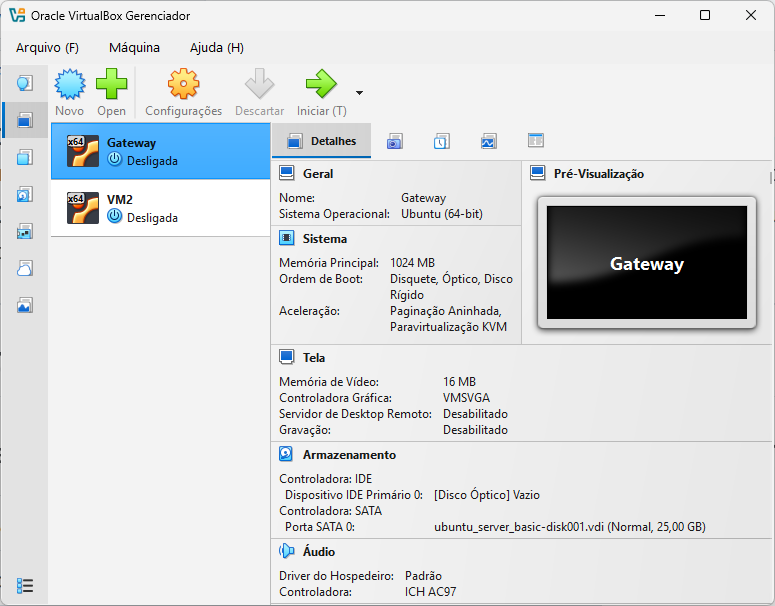

# Aula 07: Roteamento e Gateway NAT com IPTables e Rede Interna no VirtualBox

Nesta aula prática de laboratório, você aprenderá a configurar um servidor Linux Ubuntu Server como **Gateway de Rede** utilizando **NAT (Network Address Translation)** e regras de roteamento via **IPTables**. 

A topologia do laboratório será composta por duas Máquinas Virtuais (VMs):
1. **VM1 (Gateway / Router):** Possui duas placas de rede. A primeira interface () conectada em modo **Placa em Ponte (Bridge Adapter)** comunicando-se com a rede do IFAL, e a segunda interface () conectada em modo **Rede Interna (Internal Network)**.
2. **VM2 (Cliente da Rede Interna):** Possui apenas uma placa de rede conectada em modo **Rede Interna (Internal Network)** e utiliza a VM1 como seu **Gateway Padrão** para alcançar a internet.

---

## 1. Fundamentos Técnicos: Roteamento, NAT e Mascaramento de IP

### O Papel do Gateway NAT
Em redes corporativas e residenciais, o **Gateway NAT** reescreve o endereço IP de origem (*source address*) de todos os pacotes originados nas máquinas da rede privada interna (LAN) para o endereço IP público ou externo de sua própria interface WAN. 

* **Comunicação de Saída:** Quando a **VM2** () solicita uma página web na internet (ex: ), a **VM1** recebe o pacote pela interface interna , reescreve o cabeçalho IP com seu próprio IP da rede externa () e o encaminha pela interface .
* **Comunicação de Retorno:** Ao receber a resposta da internet, a **VM1** consulta sua tabela de rastreamento de conexões (*conntrack*) e devolve a resposta para a **VM2** no IP .

---

## 2. Configuração das Interface no VirtualBox

 Figura 1: VirtualBox com VMs Gateway e VM2

   
     

Topologia de Rede e Definições de IP

### Tabela 1: Definições da Rede Externa (WAN - Interface  da VM1)
| Parâmetro | Endereço / Configuração |
| :--- | :--- |
| **Rede Externa (WAN)** | 172.20.23.1 |
/| **Máscara de Sub-rede** |  (255.255.252.0) |
| **IP do Gateway Externo** | 172.20.20.1 |
| **IP da VM1 (Interface )** |  *(IP estático definido na Aula 06)* |
| **Servidores DNS** | 8.8.8.8, ,  |

### Tabela 2: Definições da Rede Interna (LAN -  da VM1 e  da VM2)
| Descrição / Equipamento | Endereço IP / Configuração |
| :--- | :--- |
| **Rede Interna (LAN)** | 10.0.0.1 |
| **Máscara de Sub-rede** |  (255.255.255.0) |
| **Broadcast** | 10.0.0.255 |
| **Gateway Interno (VM1 - Interface )** | **** |
| **Cliente da Rede Interna (VM2 - Interface )** | **** |

---

## 3. Configuração dos Adaptadores de Rede no VirtualBox

### 3.1. Configuração da VM1 (Gateway / Servidor NAT)
1. No VirtualBox, selecione a **VM1** () e abra **Configurações -> Rede**.
2. **Adaptador 1 ( - WAN):**
   * **Habilitar Placa de Rede:** Marcado
   * **Conectado a:** **Placa em Ponte (Bridge Adapter)**
   * **Nome:** Selecione a placa de rede física do Host Windows.
3. **Adaptador 2 ( - LAN):**
   * **Habilitar Placa de Rede:** Marcado
   * **Conectado a:** **Rede Interna (Internal Network)**
   * **Nome:** Digite o nome da rede interna (ex: ).

### 3.2. Configuração da VM2 (Cliente da Rede Interna)
1. No VirtualBox, selecione a **VM2** () e abra **Configurações -> Rede**.
2. **Adaptador 1 ( - LAN):**
   * **Habilitar Placa de Rede:** Marcado
   * **Conectado a:** **Rede Interna (Internal Network)**
   * **Nome:** Deve ser exatamente o mesmo nome configurado na VM1 ().

---

## 4. Configuração do Servidor Gateway (VM1)

### Passo 4.1: Configuração das Interfaces no Netplan (VM1)
Acesse a **VM1** como  e edite o arquivo de rede :

Insira a configuração das duas interfaces ( e ):

*(Lembre-se de ajustar  para o IP estático da sua VM1 definido na Aula 06).*

Aplique as alterações:

### Passo 4.2: Habilitar o Encaminhamento de Pacotes no Kernel (IP Forwarding)
Para que o kernel do Linux atue como um roteador e repasse pacotes entre as duas placas de rede:

1. **Ativar temporariamente no kernel em execução:**
   

2. **Tornar a configuração permanente:**
   Edite o arquivo :
   
   Descomente a linha removendo o caractere :
   
   Salve e aplique com .

### Passo 4.3: Configuração do Nat / Mascaramento com IPTables
Execute as regras do  para liberar o tráfego e fazer o mascaramento de IP (*MASQUERADE*) da interface interna para a externa:

---

## 5. Configuração da VM Cliente (VM2)

Acesse a **VM2** () no VirtualBox para definir o endereço IP interno  e apontar a **VM1** () como seu **Gateway Padrão**.

### Passo 5.1: Edição do Netplan na VM2
Edite o arquivo de rede na **VM2**:

Insira a configuração conforme a **Tabela 2**:

Aplique as configurações:

---

## 6. Bateria de Testes de Conectividade e Roteamento

Realize os testes para verificar o funcionamento do roteamento NAT entre as duas máquinas virtuais.

### Teste 1: Conectividade Local entre VM1 e VM2
1. Na **VM1** (Gateway), execute um ping para a VM2:
   
2. Na **VM2** (Cliente), execute um ping para a VM1:
   

### Teste 2: Conectividade da VM2 com o Gateway Externo e Internet
Na **VM2** (Cliente da rede interna), execute os pings para validar se a tradução de endereços (NAT) do Gateway está funcionando:

1. **Ping para a rede do IFAL:**
   
2. **Ping para a Internet Pública (DNS Cloudflare):**
   
3. **Ping por Nome de Domínio (Resolução DNS):**
   

### Teste 3: Rastreamento de Rotas a partir da VM2 (Traceroute)
Inspecione a sequência de saltos para comprovar que o tráfego da VM2 passa obrigatoriamente pela VM1 ():

1. **Traceroute para :**
   
   *Análise:* O **Salto 1** (*Hop 1*) deve ser o IP interno da VM1 (), e o **Salto 2** (*Hop 2*) deve ser o gateway da rede externa ().

2. **Traceroute para :**
   

---

## 7. Tarefa Prática de Laboratório (Entrega via GitHub)

Cada aluno deverá registrar o relatório técnico em seu repositório pessoal do GitHub, criando o arquivo **** estruturado no **Modelo de 7 Passos**.

### Checklist de Evidências Requeridas para o Relatório:

1. **Print da Configuração de Rede no VirtualBox:** Capturas das janelas de configuração das interfaces de rede da **VM1** (Bridge + Rede Interna) e da **VM2** (Rede Interna).
2. **Print do  dos Arquivos Netplan:**
   * Saída de  na **VM1**.
   * Saída de  na **VM2**.
3. **Print do Encaminhamento IP e IPTables na VM1:**
   * Saída de .
   * Saída de  exibindo a regra  ativa.
4. **Print dos Testes de Ping na VM2:**
   * Ping da VM2 para .
   * Ping da VM2 para  e .
5. **Print dos Comandos Traceroute na VM2:**
   * Saída do comando  na VM2.
   * Saída do comando  na VM2.

---

## 📝 Modelo de Relatório Técnico (Estrutura de 7 Passos)

1. **Identificação:** Nome completo, matrícula, turma (BSI 2026.02), data e título da prática.
2. **Objetivo:** Explicação sobre o funcionamento de um Servidor Gateway com NAT e mascaramento de IP usando IPTables.
3. **Ambiente:** Especificação das duas VMs no VirtualBox (VM1 com 2 placas, VM2 com 1 placa em Rede Interna).
4. **Procedimento:** Descrição passo a passo da configuração dos arquivos Netplan, habilitação do  e aplicação das regras de .
5. **Testes e Evidências:** Apresentação dos prints e comandos diagnósticos (, , , ).
6. **Problemas e Soluções:** Registro de eventuais dificuldades enfrentadas (ex: erro no nome da rede interna, falta de habilitação do ip_forward ou firewall bloqueando) e como foram solucionados.
7. **Conclusão:** Reflexão sobre a importância do roteamento NAT na interconexão e segurança de redes privadas.
